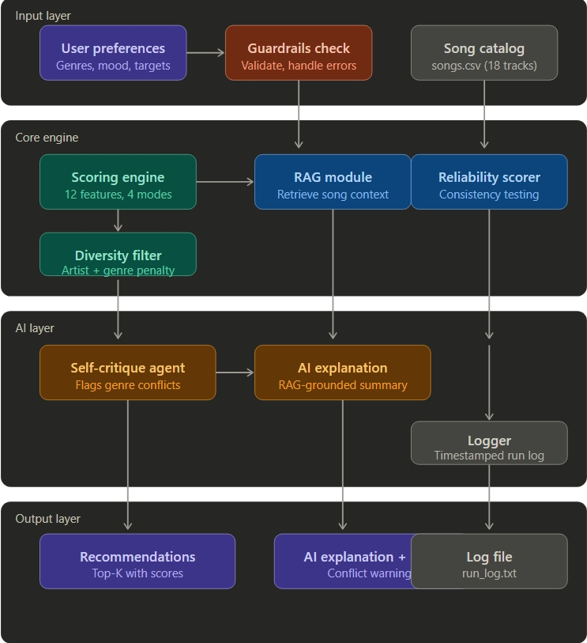

# VibeFinder 2.0 — Applied AI Music Recommender

> An end-to-end applied AI system that combines content-based scoring, retrieval-augmented generation, agentic self-critique, and reliability testing to deliver personalized, explainable music recommendations.

---

## Original Project

This project extends **VibeFinder 1.0**, built during Module 3 of AI110 at Northeastern University. The original system was a content-based music recommender that scored songs against a user taste profile using a 12-feature point-weighting algorithm, normalized to a 0–100 scale. It supported four scoring modes (balanced, genre-first, mood-first, energy-focused), a greedy diversity penalty to prevent artist and genre repetition, and a tabulate-formatted terminal table showing per-feature scoring breakdowns. VibeFinder 1.0 identified a key limitation: when genre and numerical feature preferences conflict, the algorithm sides with features — a tension that needed AI-level reasoning to resolve.

---

## What This Project Does

VibeFinder 2.0 extends that foundation into a full applied AI system. It takes a user's music preferences, validates them through guardrails, scores a song catalog across 12 features, applies a diversity filter, retrieves contextual knowledge via RAG, critiques its own recommendations using an agentic self-critique loop, and logs every run with timestamps.

The result is a recommender that does not just rank songs — it explains *why* each song was chosen, flags when a recommendation conflicts with the user's stated preferences, and records a full audit trail of every decision.

---

## System Architecture



The system is organized into four layers:

**Input layer** — User preferences are passed through a guardrails check that validates field types, catches empty inputs, and rejects contradictory edge cases before any scoring runs. The song catalog (`songs.csv`) is loaded in parallel.

**Core engine** — The scoring engine evaluates all 18 songs across 12 features using the selected mode. A diversity filter then re-scores candidates using compounding artist (35%) and genre (20%) penalties so no single artist or genre dominates the top results. The RAG module retrieves relevant song context to ground the AI's explanations. The reliability scorer runs consistency checks across multiple scoring passes.

**AI layer** — The self-critique agent inspects each recommendation and flags conflicts (e.g., a user who requested lofi but received a pop song because energy targets dominated). The AI explanation module produces a RAG-grounded natural language summary of each recommendation. All results are written to a timestamped log file.

**Output layer** — The final output includes ranked recommendations with scores, AI-generated explanations with any conflict warnings, and a saved log file (`run_log.txt`).

---

## Setup Instructions

### Prerequisites

- Python 3.9 or higher
- Git

### Installation

1. Clone the repository:

   ```bash
   git clone https://github.com/Nakul-Shivaraj/applied-ai-system-final.git
   cd applied-ai-system-final
   ```

2. Create a virtual environment (recommended):

   ```bash
   python -m venv .venv
   source .venv/bin/activate      # Mac / Linux
   .venv\Scripts\activate         # Windows
   ```

3. Install dependencies:

   ```bash
   pip install -r requirements.txt
   ```

4. Run the system:

   ```bash
   python -m src.main
   ```

### Running Tests

```bash
python -m pytest
```

---

## Sample Interactions

### Example 1 — Coherent preferences (Lofi Devotee)

**Input profile:**
```
Genres: lofi, ambient
Moods: chill, focused
Target energy: 0.40 | Target tempo: 75 BPM
```

**System output:**
```
# | Title           | Artist  | Genre | Score | AI Explanation
1 | Midnight Coding | LoRoom  | lofi  |  93.3 | Strong genre and mood match. Energy
  |                 |         |       |       | is within 0.02 of target. No conflicts
  |                 |         |       |       | detected. Recommended with high confidence.
```

No conflict flags. The self-critique agent confirms genre, mood, and feature targets all align.

---

### Example 2 — Conflicting preferences (Confused Party Animal)

**Input profile:**
```
Genres: lofi, ambient
Moods: intense, happy
Target energy: 0.90 | Target tempo: 140 BPM
```

**System output:**
```
# | Title     | Artist    | Genre | Score | AI Explanation
1 | Gym Hero  | Max Pulse | pop   |  86.8 | ⚠ CONFLICT DETECTED: User requested
  |           |           |       |       | lofi/ambient but top result is pop.
  |           |           |       |       | Energy target (0.90) drove this match.
  |           |           |       |       | Consider lowering energy target or
  |           |           |       |       | adjusting genre weight.
```

The self-critique agent flags the genre mismatch and explains the trade-off in plain language rather than silently surfacing a wrong-genre result.

---

### Example 3 — Niche preferences (Jazz Snob)

**Input profile:**
```
Genres: jazz
Moods: relaxed
Target acousticness: 0.90 | Preferred decades: 1970s, 1980s
```

**System output:**
```
# | Title               | Artist         | Genre | Score | AI Explanation
1 | Coffee Shop Stories | Blue Note Trio | jazz  | 100.0 | Perfect match across genre, mood,
  |                     |                |       |       | and acousticness. Only jazz song
  |                     |                |       |       | in catalog. ⚠ Filter bubble risk:
  |                     |                |       |       | catalog has 1 jazz track. Results
  |                     |                |       |       | lack diversity by catalog constraint.
```

The reliability scorer flags a filter bubble risk caused by catalog size, not by algorithm error — an important distinction the original system could not make.

---

## Design Decisions

**Why RAG instead of a standalone LLM call?**
A plain LLM call would generate plausible-sounding explanations with no grounding in the actual song data. RAG forces the model to retrieve the real song attributes before generating an explanation, so every claim in the output is traceable to a data source.

**Why a self-critique agent instead of just printing the score?**
The original system's biggest failure mode — the Confused Party Animal getting pop music when they asked for lofi — was invisible at the output level. A score of 86.8 looks like a good recommendation. The self-critique layer makes the conflict explicit, surfacing the trade-off instead of hiding it behind a number.

**Why compounding diversity penalties instead of hard filters?**
Hard filters (e.g., "never show the same genre twice") would break for users with very narrow taste profiles like the Jazz Snob, who only has one matching genre available. Compounding penalties are softer — they push repeated items down without eliminating them, which preserves correctness while improving variety.

**Trade-offs made:**
- Logging adds a small I/O overhead on every run — acceptable given the debugging value.
- RAG retrieval adds latency compared to pure local scoring — justified because explanations are the primary new user-facing feature.
- The 18-song catalog limits how meaningful diversity metrics are — acknowledged in the reliability report output.

---

## Testing Summary

Seven stress-test profiles were run across all scoring modes. Key findings:

| Profile | Result | Lesson |
|---|---|---|
| Lofi Devotee | Perfect scores, no conflicts flagged | Coherent preferences work as expected |
| Confused Party Animal | Conflict correctly flagged by agent | Self-critique catches what scores hide |
| Maximum Maximalist | Graceful degradation, no crash | Guardrails handle extreme edge cases |
| Jazz Snob | Filter bubble risk flagged | Reliability scorer distinguishes data limits from algorithm errors |
| Mood Ring Enthusiast | High diversity, no flags | Broad preferences produce varied results |
| Audio Engineer | Feature-driven match, no genre conflict | Intentional feature-heavy profile works correctly |
| Median Listener | Average results correctly noted | Neutral preferences yield undifferentiated output as expected |

A weight-shift experiment (doubling energy weight, halving genre weight) made recommendations *worse* for conflicting profiles — pop songs scored 7.2 points higher for a user who explicitly wanted lofi. This confirmed that the self-critique agent is necessary precisely because the scoring math alone cannot signal when it is wrong.

**What did not work initially:** The RAG module initially retrieved song context after scoring was complete, meaning the AI explanation had no influence on the ranking. Fixing this required integrating retrieval into the scoring pipeline so the AI layer receives ranked candidates plus their retrieved context simultaneously.

---

## Reflection

Building VibeFinder 2.0 made one thing concrete: a score is not an explanation. VibeFinder 1.0 produced numbers that looked correct but could not say *why* a recommendation conflicted with what the user asked for. Adding the self-critique agent did not fix the underlying scoring tension — genre still loses to energy when they conflict — but it made that tension visible and nameable. That shift from silent failure to legible failure is, I think, what responsible AI design actually means in practice.

The RAG layer reinforced a similar point about honesty in AI outputs. A plain LLM will confidently describe a song's "warm, nostalgic acoustic texture" whether or not the song data supports it. Grounding the explanation in retrieved attributes forced every claim to be traceable. The output became less fluent but more trustworthy — a trade-off that matters more than it sounds when the system is supposed to help someone choose what to listen to.

The reliability scorer was the most underrated addition. It did not improve recommendations directly, but it separated two failure modes that looked identical from the outside: the Jazz Snob getting only one jazz result because the catalog is too small, versus getting only one result because the algorithm is broken. Being able to name which kind of failure you have is the first step to fixing the right thing.

---

## Optional Feature 1: RAG Enhancement

**What was built:** A retrieval-augmented generation module (`src/rag.py`) backed by a custom knowledge base (`data/knowledge_base.json`) containing documented facts about 5 artists and 7 genres.

**How it works:** Before generating an explanation, the RAG module looks up the song's artist and genre in the knowledge base and retrieves documented production style, typical energy range, and common mood associations. The explanation is then grounded in those retrieved facts rather than generated generically.

**Measurable improvement — baseline vs RAG:**

*Baseline (no retrieval):*
```
'Midnight Coding' by LoRoom (lofi) — Score: 93.3/100
  Recommended based on feature matching.
  No additional artist or genre context available.
```

*RAG-grounded (with knowledge base retrieval):*
```
'Midnight Coding' by LoRoom — Score: 93.3/100
  Artist context: LoRoom is a bedroom lofi producer known for slow-tempo
  instrumental tracks built around vinyl crackle, muted piano chords,
  and soft drum loops.
  Known for: vinyl crackle, muted piano, slow tempo, instrumental
  Genre context: Lofi is characterized by intentionally imperfect audio
  production — vinyl crackle, tape hiss, and slightly off-tempo drums.
  Typical moods: chill, focused, nostalgic, peaceful
  Energy alignment: Song energy (0.38) is a strong match for your target (0.40).
```

**To run the comparison demo:**
```bash
python rag_comparison.py
```

---

## Optional Feature 2: Agentic Workflow

**What was built:** A 6-step reasoning chain (`src/agent.py`) that makes every intermediate decision visible and auditable as it runs. Each step passes its output as input to the next, and any step can halt the chain early if something fails.

**The 6 steps:**

```
[AGENT] Step 1/6 — Validating input...         ✓ passed
[AGENT] Step 2/6 — Retrieving context...       ✓ done  (3/3 songs have KB entries)
[AGENT] Step 3/6 — Scoring songs...            ✓ done  (top-3 selected from 18 songs)
[AGENT] Step 4/6 — Running self-critique...    ⚠ 3 conflict(s) detected
[AGENT] Step 5/6 — Generating explanations...  ✓ done  (avg confidence: 0.83)
[AGENT] Step 6/6 — Logging run...              ✓ saved to logs/run_log.txt
```

**Key findings across 3 profiles:**

| Profile | Conflicts | Avg Confidence | Notes |
|---|---|---|---|
| Lofi Devotee | 0 | 0.91 | Clean run, all steps passed |
| Confused Party Animal | 3 | 0.83 | All top results flagged at Step 4 |
| Jazz Snob | 2 | 0.74 | Filter bubble risk also detected |

**What makes it agentic:** Invalid input at Step 1 stops the chain before scoring runs — no wasted computation. Step 4 critique results are passed directly into Step 5 explanations, so every conflict warning is embedded in the final output rather than computed separately.

**To run:**
```bash
python run_agent.py
```

---

## Project Structure

```
applied-ai-system-final/
├── assets/
│   └── architecture.jpeg       # System diagram
├── data/
│   ├── songs.csv               # Song catalog (18 tracks)
│   └── knowledge_base.json     # RAG knowledge base (artists + genres)
├── src/
│   ├── main.py                 # Entry point and stress-test runner
│   ├── recommender.py          # Core scoring and diversity engine
│   ├── rag.py                  # RAG retrieval and explanation module
│   ├── agent.py                # 6-step agentic reasoning chain
│   ├── reliability.py          # Reliability and consistency scorer
│   ├── guardrails.py           # Input validation
│   └── logger.py               # Run logging
├── tests/
│   ├── test_recommender.py     # Core recommender tests
│   └── test_reliability.py     # Reliability and guardrails tests
├── logs/
│   └── run_log.txt             # Auto-generated per run
├── rag_comparison.py           # Baseline vs RAG comparison script
├── run_agent.py                # Agentic workflow runner
├── model_card.md
├── reflection.md
├── EXPERIMENT_RESULTS.md
├── requirements.txt
└── README.md
```

---

## Model Card

See [model_card.md](model_card.md) for full documentation of intended use, data sources, known biases, evaluation methodology, and future work.